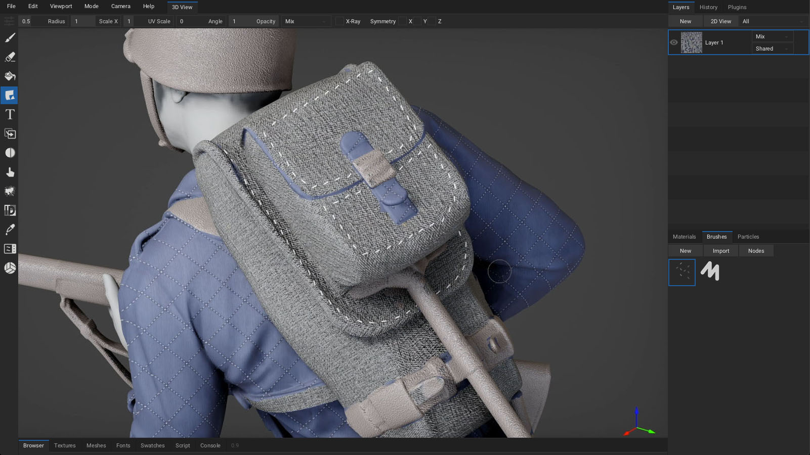
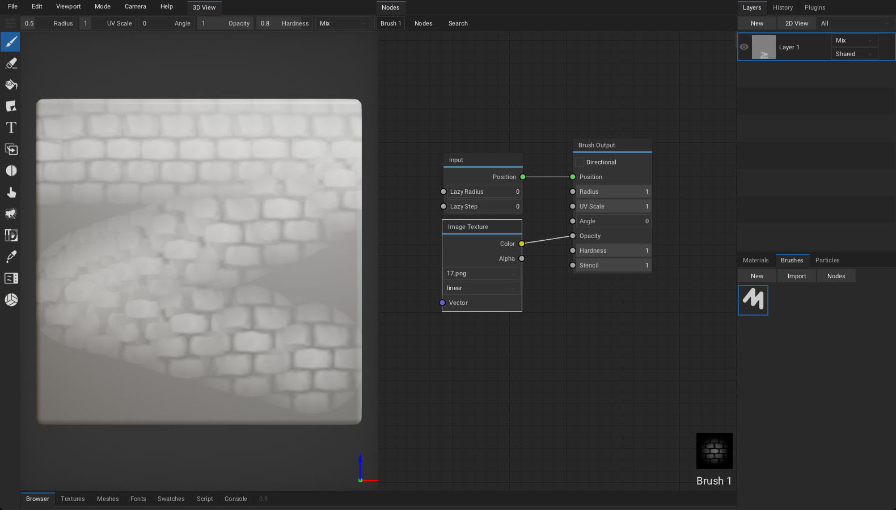
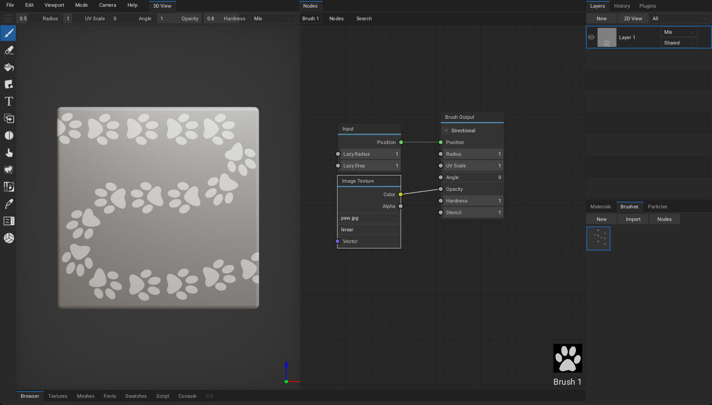
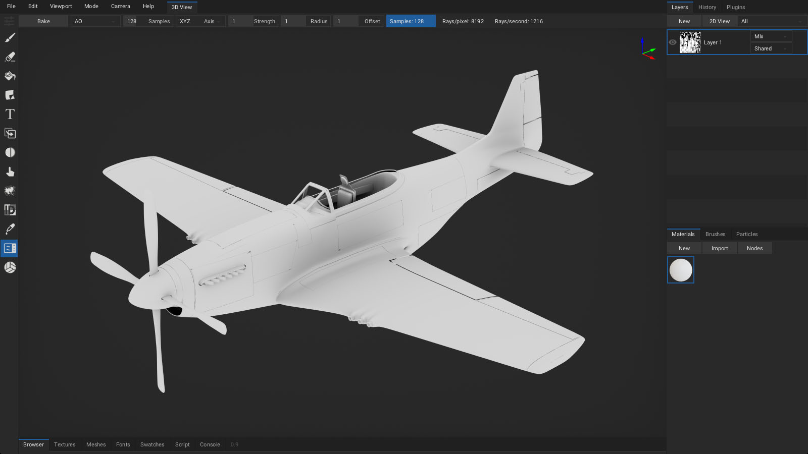
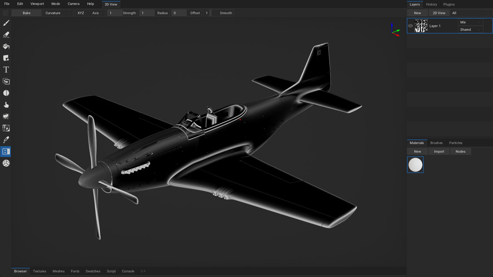
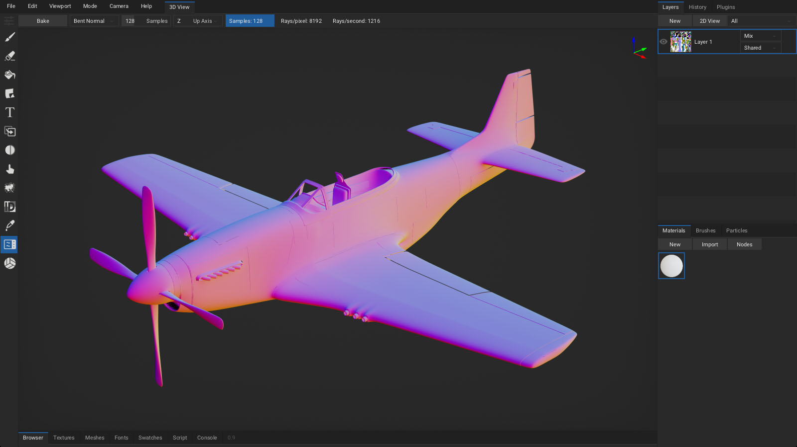
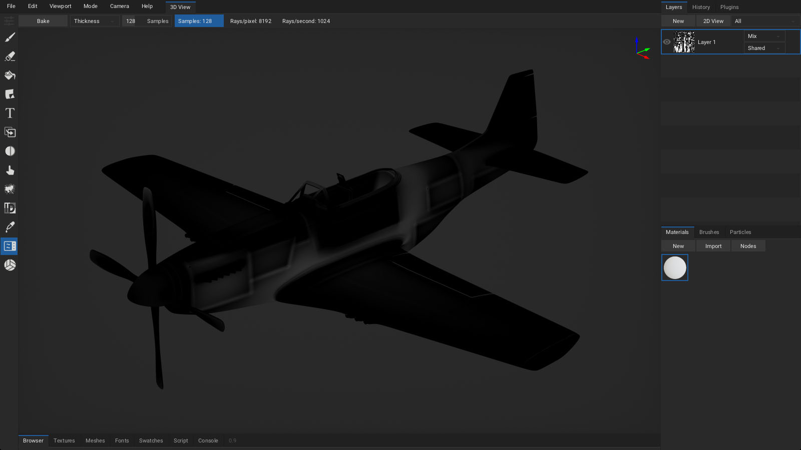

# Welcome

*Version [1.0alpha](https://github.com/armory3d/armorpaint_web/tree/main/manual.md)*

ArmorPaint is a stand-alone software designed for physically-based texture painting. Drag & drop your 3D models and start painting. Receive instant visual feedback in the viewport as you paint.

> The alpha version has many rough edges and the experience may be frustrating.

---

# Download

**Windows (10 or newer)**, **Linux** or **macOS (apple silicion)** is recommended. Experimental **iOS** and **Android** builds are also provided. On desktop, ArmorPaint is a portable application with no installation - just unpack and run.

> [Get ArmorPaint](https://armorpaint.org/download.html)

#### Requirements

Painting process in ArmorPaint runs on the GPU and the performance mainly depends on a graphics card. Minimum for 4K painting is an Intel HD4000 graphics card. For 16K painting, Nvidia RTX 2080/8GB or better is recommended.

> See [Preferences](https://armorpaint.org/manual#preferences) to tune performance.

#### Updating

Latest builds can be downloaded through your [Itch Library](https://itch.io/my-purchases) or [Gumroad Library](https://gumroad.com/library). Learn more [here](https://armorpaint.org/login).

> In ArmorPaint, press `Help - Check for Updates...` to check if newer build is available.

     

# Get Started

<iframe style="top:0;left:0;width:100%;height:100%;max-width:560px;" src="https://www.youtube.com/embed/y2slMWkVkOE" frameborder="0" allow="accelerometer; autoplay; encrypted-media; gyroscope; picture-in-picture" allowfullscreen></iframe>

#### Windows

Unpack downloaded archive and run `ArmorPaint.exe`. In some cases, Windows may prompt you with the unrecognized app dialog - press `More Info - Run Anyway`.

#### Linux

Unpack downloaded archive and run `ArmorPaint`. In some cases, you may need to open terminal in the extracted folder and run `./ArmorPaint`.

#### macOS

Unpack downloaded archive and run `ArmorPaint.app`.

#### iOS

*Experimental:* Available on the [AppStore](https://apps.apple.com/us/app/armorpaint/id1533967534).

#### Android

*Experimental:* Available on [Google Play](https://play.google.com/store/apps/details?id=org.armorpaint).

#### Controls

- `Left mouse button / Pen` to paint.
- `Alt` + `left mouse button` to rotate the camera.
- `Alt` + `middle mouse button` to pan the camera.
- `Alt` + `right mouse button` / `mouse wheel` to zoom in and out.
- Controls can be customized in `Menu bar - Edit - Preferences... - Keymap`.
- Default or Blender keymap preset can be selected.
- Keymap presets can be imported and exported.

     

# Workflow

#### Import Meshes

Drag and drop unwrapped `.obj` file into the viewport. This will replace the currently painted mesh. `.fbx`, `.blend`, `.stl`, `.gltf` and `.glb` files are supported, but the importer is not 100% reliable yet. Up to ~4GB `.obj` files are supported.

In the `Import Mesh` dialog:
- Set `Split By` combo to `UDIM Tile` to parse imported `.obj` mesh into UDIM tiles.
- Enable `Parse Transforms` to load per-object transforms from `.fbx` file.
- Enable `Parse Vertex Colors` to load vertex color data from `.fbx` or `.blend` file.

Modifying imported mesh data:
- Normals can be re-calculated with `Meshes tab - Edit - Calculate Normals`.
- Up axis can be set with `Meshes tab - Edit - Rotate X / Rotate Y / Rotate Z`.
- Geometry can be re-centered with `Meshes tab - Edit - Geometry to Origin`.
- Height output can be applied to geometry with `Meshes tab - Edit - Apply Displacement`.
- UV map can be auto-generated with `Meshes tab - Edit - UV Unwrap`.
- Keep in mind that if you modify UV map of the imported mesh, you will have to also [export the modified mesh](https://armorpaint.org/manual#export-mesh) back out of ArmorPaint alongside the painted textures so they can be UV mapped properly.

> You can get sample assets for testing in the [ArmorPaint cloud](https://armorpaint.org/cloud).

> See `Menu bar - Preferences... - Plugins` to enable support for additional mesh formats.

#### Import Materials

Drag and drop a folder with PBR texture set onto the viewport. ArmorPaint will recognize the file extensions and create a new material from imported textures. Multiple folders can be dropped at once.

Click on the `Materials tab - Import` button to import materials from ArmorPaint `.arm` files or Blender `.blend` files. *wip*

> You can get starter content in the [ArmorPaint Cloud](https://armorpaint.org/cloud).

#### Import Textures

Drag and drop `.jpg`, `.png`, `.tga`, `.bmp`, `.gif`, `.psd`, `.hdr`, `.svg`, `.exr` (uncompressed only) or `.tif` images into the node editor. This will import the image and place a new `Image` node onto the canvas.

> See `Menu bar - Preferences... - Plugins` to enable support for additional image formats.

#### Export Textures

Click on the `Menu bar - File - Export Textures...` button.

- `Resolution`: Set resolution for exported textures.
- `Color`: Set `8bit`, `16bit` or `32bit` color depth.
- `Format`: `.png` or `.jpg` (for `8bit` color), `.exr` (for `16bit / 32bit` color).
- `Layers`: Export all visible layers or selected layers only into textures.
- `Preset`: Select a pre-configured preset or build a custom one.
  - `Generic` preset exports individual PBR textures.
  - `Unreal` preset exports packed *occlusion-roughness-metallic* texture.
  - `Unity` preset exports packed *metallic-occlusion-smoothness* texture.
  - `Minecraft` preset exports packed *metallic-emission-roughness* texture.
  - `base_color` preset exports only the base color texture.
- `Destination`: Export textures to disk or pack into the project file at `Textures tab`.

Configure custom channel swizzling for exported textures in `Presets` tab:
- Select an existing preset you wish to edit or press `New`.
- Press `Import` to import preset from `.json` file.
- Press `Add` to create new texture slot.
- Configure `RGBA` channels for each texture slot.
- Right-click on texture name and press `Delete` to delete texture slot.
- `.json` file for each preset is located in the `ArmorPaint/data/presets` folder.

 

Create object groups in `Atlases` tab:
- Assign atlas number to objects
- Multiple objects can share a single material via altas
- One texture set per atlas is written during texture export

#### Export Mesh

Click on the `Menu bar - File - Export Mesh...` button to save the currently loaded mesh into `.obj` file. This is handy if you only have access to the `.arm` project file or want to export the mesh which has been unwrapped / modified in ArmorPaint.

#### Save / Load Project

Click on the `Menu bar - File - Save` button (`Ctrl + S`) to save the currently opened project. Mesh, layers, materials and brushes will be saved into `.arm` project file.

To open the project file, drag and drop `.arm` file onto the viewport. `.arm` files can also be set to open directly with ArmorPaint executable from the OS file explorer.

`.obj` and other asset types can also be associated if you wish to use ArmorPaint as a model / texture viewer.

#### Browser

Click on the `Status bar - Browser tab` to activate the built-in asset browser.
- Click on the `Cloud` button to access the [ArmorPaint cloud](https://armorpaint.org/cloud).
- Drag assets from browser into the viewport to import.
- For `.arm` materials, preview icons are displayed.
- Click on the `+` button to save the current path into bookmarks panel.
- Press `ctrl+f` keys to activate search in the current folder.
 

     

# Tools

#### Brush

Select `Brush`(`B`) tool from toolbar. Configure brush parameters in the header. Use `left mouse button` / `pen` to paint strokes using the selected material.

- `Radius`: Brush size. (Hold `F` key and move the cursor)
- `UV Scale`: Scale the coords for currently painted material.
- `Angle`: Rotate the coords for currently painted material.
- `Opacity`: Overall opacity of the brush stroke. (Hold `Shift+F` key and move the cursor)
- `Hardness`: Fade opacity towards the brush stroke edge.
- `Blending`: Blending mode used for painting.
- `TexCoord`: Coordinates used for texture sampling. Mesh `UV Map`, `Project` from view or `Triplanar` mapping.
- `X-Ray`: Paint through mesh faces.
- `Symmetry`: Mirror brush strokes on the X, Y and/or Z axis.

Hold brush ruler key (`SHIFT`) when painting to restrict strokes horizontally or vertically. Hold brush ruler key (`SHIFT`) and click onto the surface to paint lines.

#### Eraser

Select `Eraser`(`E`) tool from toolbar. Use `left mouse button` / `pen` to erase strokes on the currently selected layer.

- `Radius`: Eraser size.
- `Opacity`: Overall opacity of the eraser stroke.
- `Hardness`: Fade opacity towards the eraser stroke edge.
- `X-Ray`: Erase through mesh faces.
- `Symmetry`: Mirror eraser strokes on the X, Y and/or Z axis.

#### Fill

Select `Fill`(`G`) tool from toolbar. Press `left mouse button` / `pen` to fill active layer with selected material. Fill tool respects active object mask, material mask and color id mask.

- `UV Scale`: Scale the coords for currently painted material.
- `Angle`: Rotate the coords for currently painted material.
- `Opacity`: Overall opacity of the fill effect.
- `Blending`: Blending mode used for fill effect.
- `TexCoord`: Coordinates used for texture sampling. Mesh `UV Map`, `Project` from view or `Triplanar` mapping.
- `Fill Mode`: Allows to fill individual mesh faces.

#### Decal

Select `Decal`(`D`) tool from toolbar. Press `left mouse button` / `pen` to apply active material as a decal onto the surface.

- `Radius`: Decal size.
- `Scale X`: Scale decal size horizontally.
- `UV Scale`: Scale the coords for currently painted material.
- `Angle`: Rotate the coords for currently painted material.
- `Opacity`: Overall opacity of the decal.
- `Blending`: Blending mode used for applying decal.
- `X-Ray`: Apply decal through mesh faces.
- `Symmetry`: Mirror decal on the X, Y and/or Z axis.

#### Text

Select `Text`(`T`) tool from toolbar. Press `left mouse button` / `pen` to apply active material as a text onto the surface. Drag and drop a `.ttf` file into the viewport to change the font.

- `Radius`: Text size.
- `UV Scale`: Scale the coords for currently painted material.
- `Angle`: Rotate the coords for currently painted material.
- `Opacity`: Overall opacity of the text.
- `Blending`: Blending mode used for applying text.
- `Font`: Select which font to apply.
- `Text`: Type a text to apply.
- `X-Ray`: Apply text through mesh faces.
- `Symmetry`: Mirror text on the X, Y and/or Z axis.

> See `Fonts tab` to manage imported fonts. Click `2D View` to preview the font.

#### Clone

Select `Clone`(`L`) tool from toolbar. Hold `ALT` to set clone source location. Use `left mouse button` / `pen` to clone the material from source location to active location.

- `Radius`: Brush size.
- `Opacity`: Overall opacity of the brush stroke.
- `Blending`: Blending mode used for painting.
- `X-Ray`: Paint through mesh faces.
- `Symmetry`: Mirror brush strokes on the X, Y and/or Z axis.

#### Blur

Select `Blur`(`U`) tool from toolbar. Use `left mouse button` / `pen` to blur the material applied to the surface.

- `Radius`: Brush size.
- `Opacity`: Overall opacity of the brush stroke.
- `Blending`: Blending mode used for painting.
- `X-Ray`: Paint through mesh faces.
- `Symmetry`: Mirror brush strokes on the X, Y and/or Z axis.

#### Smudge

Select `Smudge`(`M`) tool from toolbar. Use `left mouse button` / `pen` to smudge / smear the material applied to the surface.

- `Radius`: Brush size.
- `Opacity`: Overall opacity of the brush stroke.
- `Blending`: Blending mode used for painting.
- `X-Ray`: Paint through mesh faces.
- `Symmetry`: Mirror brush strokes on the X, Y and/or Z axis.

#### Particle *wip*

Select `Particle`(`P`) tool from toolbar. Use `left mouse button` / `pen` to apply particles onto the surface.

- `Radius`: Particle emitter size.
- `Opacity`: Overall opacity of the emitted particle.
- `Blending`: Blending mode used for applying particles.
- `X-Ray`: Apply particles through mesh faces.
- `Symmetry`: Mirror particles on the X, Y and/or Z axis.

#### Bake

Select `Bake`(`K`) tool from toolbar. Pick bake mode, then click the `Bake` button or press and hold `left mouse button` / `pen` in viewport to apply bake into the base color channel of active layer or mask. For ray-traced bake modes, multiple samples (set via the `Samples` option) will get accumulated until the operation is complete.

> See [Baking](https://armorpaint.org/manual#baking) to learn about bake modes.

#### Color ID

Select `Color ID`(`C`) tool from toolbar. Drag and drop color-id texture onto the viewport and assign it into the `Color ID Map` field. Afterwards, click on a model to pick a specific color. All drawing operations will now be restricted to this color. Picked color can be removed with a `Clear` button.

#### Picker

Select `Picker`(`V`) tool from toolbar. Press `left mouse button` / `pen` in viewport to read material values from the surface. Base color, normal, occlusion, roughness and metallic values will be displayed in the header.

- `Select Material`: When enabled, the material you pick from the mesh surface will also get auto-selected in the `Materials tab`.
- `Mask`: When set to `Material`, all drawing operations will be restricted to the surface where picked material is painted.

#### Material

Select `Material` tool from toolbar. A live material preview will be displayed in the viewport, allowing for easier material creation.

#### Gizmo *wip*

Select `Gizmo` tool from toolbar. A gizmo will appear in the viewport allowing you to adjust the transform of objects in the scene.

     

# Materials

Materials in ArmorPaint are composed with nodes. When painting, brush applies a material onto the surface. To compose a material, open node editor by clicking `Materials tab - Nodes` (`TAB`).
- Use toolbar at the top to add new nodes.
- Press `space` to search for nodes.
- Drag textures from `Textures tab` or file explorer into the node editor to create `Image` nodes.

Material preview is displayed instantly in the `Materials tab` as the nodes are assembled.

Right-click onto material preview to expose material operations:
- Set which channels the material should affect.
- Create `Fill Layer` from selected material.
- `Duplicate` material.
- `Export` material into `.arm` file.
- `Bake` material into textures.
- `Delete` material.

> Drag and drop material into viewport or Layers tab to create a fill layer.

> ArmorPaint material nodes mimick the Cycles nodes. See [Cycles nodes documentation](https://docs.blender.org/manual/en/latest/render/shader_nodes/index.html).

> See [Import Materials](https://armorpaint.org/manual#importmaterials).

> See currently implemented [material nodes](https://github.com/armory3d/armortools/blob/main/base/Sources/arm/shader/NodesMaterial.hx).

> Use `Swatches tab` to save and load color sets.

     

# Neural Nodes

Double click on node header or click the eye icon to preview the node output. Press Run to process the selected node.

#### Edit Image Node

#### Image to Depth Node

#### Image to Normal Map Node

#### Image to PBR Node

Extract base color, occlusion, roughness, normal map and height from color input. A photo image is expected as a color input.

#### Inpaint Image Node

Allows to paint a mask in the viewport. Outputs a texture where mask area is filled with new content.

#### Text to Image Node

Generate a photo described via text prompt.

#### Tile Image Node

Outputs a tileable texture with removed seams from color input.

#### Upscale Image Node

Upscales color input to the current project resolution selected in the node editor header.

#### Vary Image Node

Generates a new image variant guided with text prompt.

> Check out the [gallery](https://armory3d.org/lab/gallery.html) to see nodes in action.

     

# Brushes

Brushes in ArmorPaint are composed with nodes. When painting, brush nodes are evaluated for each painted stroke. To compose a brush, open node editor by clicking `Brushes tab - Nodes (TAB)`.
- Use toolbar at the top to add new nodes.
- Press `space` to search for nodes.
- Drag textures from `Textures tab` or file explorer into the node editor to create `Image` nodes.

Brush preview is displayed instantly in the `Brushes tab` as the nodes are assembled.

Right-click onto brush preview to expose brush operations:
- Duplicate brush.
- Export brush into `.arm` file.
- Delete brush.

> Brushes can be imported from `.arm` files by clicking `Brushes tab - Import`.

> See currently implemented [brush nodes](https://github.com/armory3d/armortools/tree/main/base/Sources/arm/logic).

#### Brush Mask

To use image as a brush mask:
- Drag and drop brush mask image into the node editor.
- Connect newly placed `Image Texture` node to the `Brush Output - Opacity` socket.
 

#### Brush Jitter

- Connect `Random` brush node with `Brush Output` sockets to jitter desired properties.
 

#### Lazy Mouse

- Raise `Lazy Radius` value of the `Input` brush node to make the paint cursor follow the mouse in delay. This can be useful to paint smooth strokes.
- Raise `Lazy Step` value of the `Input` brush node to paint strokes in steps.
 

#### Directional Brush

- By enabling the `Direction` value of the `Brush Output` node, painted strokes will follow the brush path. Decal and brush mask will be oriented to match the direction of a brush.
 

#### Brush Stencil

To use image as a brush stencil:
- Drag and drop stencil image into the node editor.
- Connect newly placed `Image Texture` node to the `Brush Output - Stencil` socket.
- Hold `ctrl` (`stencil_transform`) key to show transform controls.
- Hold `z` (`stencil_hide`) key to make stencil invisible while still taking effect.
 

     

# Layers

To create a new layer, press `Layers tab - New` and select a layer type:
- `Paint Layer`.
- `Fill Layer` from active material.
- `Decal Layer` from active material.
- `Black Mask` or `White Mask`.
- `Fill Mask` from active material.
- `Group` containing active layer.

Brush will paint onto the currently selected layer.

- Layer can be parented to the specific object by setting the `Object` combo property. This allows to utilize multiple UV maps per project - each object having it's individual UV map.
- Use drag and drop to reorder layers.
- Double-click onto layer, mask or group name to rename it.

Right-click on the layer to expose layer operations:

- Set `Opacity`, `Resolution` and  `Color` depth.
- For fill layers, set `UV Scale`, `Angle` and `TexCoord` type.
- Convert layer to `Fill Layer` or `Paint Layer`.
- `Export` selected layer.
- `Merge` the layer down.
- `Duplicate` the layer.
- `Clear` the layer.
- `Delete` the layer.
- Set which channels the layer should affect.

Right-click on the mask to expose mask operations:

- Set `Opacity` and `Resolution`.
- For fill masks, set `UV Scale`, `Angle` and `TexCoord` type.
- Convert mask to `Fill Mask` or `Paint Mask`.
- `Export` mask texture.
- `Merge` the mask down.
- `Duplicate` the mask.
- `Clear` the mask.
- `Apply` mask to parent layer.
- `Delete` the mask.
- `Invert` the mask.

> Drag textures from `Textures tab` into the viewport or `Layers` tab to create mask for active layer.

#### 2D View

Click `Layers tab - 2D View` to show the channels of the selected layer. The 2D View is updated immediately as you paint.

- Paint tools are usable directly inside the 2D view.
- Press `Textures tab - 2D View` to show selected image inside 2D view.

In the 2D View top bar:
- Show the selected layer or all visible layers.
- Select which channel to show.
- Display UV map as a wireframe.
- Tile the texture.

     

# Viewport

Set viewport parameters in `Menu bar - Viewport`.

- Enable `Distract Free` (`F11`) mode.
- `Toggle Fullscreen` (`alt+enter`) mode.
- Set `Environment` intensity.
- Enable `Split View` for side-by-side viewports.
- Enable `Cull Backfaces` to skip drawing backward facing polygons.
- Enable `Filter Textures` to apply linear filter when sampling textures references by material.
- Show `Wireframe` in the viewport.
- Enable `Texels` to visualize texture pixels in the viewport with a checker pattern.
- Show 3D `Compass` in the viewport.
- Enable `Envmap` to draw environment map in the viewport.
- Enable `Blur Envmap` to use blurred version of the environment map.
- Press `Reset Envmap` to replace currently imported environment map with the default one.

> Drag and drop a `.hdr` file onto the viewport to change the environment map.

> Hold `Ctrl` + `middle mouse button` to rotate environment map.

> To simulate pixel-art like painting, disable `Filter Textures` option and set `Super Sample` in preferences to `0.25x`.
>  

#### Viewport Mode

Set viewport render mode in `Menu bar - Mode`.
- Pick `Lit` to draw viewport with applied lighting using the rasterizer.
- Pick specific channel to visualize it with no applied lighting.
- Pick `Path Traced` to draw viewport with interactive path-tracer. (on DirectX / Vulkan raytracing GPUs and Metal devices*)

#### Path Traced Viewport *wip*

- Available on GPUs with DirectX (Windows) / Vulkan (Linux) raytracing support.
- Available on macOS with Apple silicion.
- Available on iOS with Apple M1 or newer.
- The renderer favors performance.

<iframe style="top:0;left:0;width:100%;height:100%;max-width:560px;" src="https://www.youtube.com/embed/uQb-LOJdYrE" frameborder="0" allow="accelerometer; autoplay; encrypted-media; gyroscope; picture-in-picture" allowfullscreen></iframe>

#### Camera

Set camera parameters in `Menu bar - Camera`:

- Set specific camera viewpoint.
- `Orbit`, `Zoom In` and `Zoom Out` camera.
- `Reset` camera.
- Set `FoV` (field of view).
- Set `Perspective` or `Orthographic` camera type.
- Set camera mode:
  - `Orbit` - Rotate camera around the mesh.
  - `Rotate` - Rotate mesh around the origin.
  - `Fly` - Hold `right mouse button` and move camera freely using the `WASD` and `QE` keys.

     

# Baking

Select [Bake tool](https://armorpaint.org/manual#bake) from the toolbar.

- `AO (raytracing GPUs)`: Bake ambient occlusion. `Strength`, `Radius` and `Offset` can be configured.
 

- `Curvature`: Bake mesh curvature. `Strength`, `Radius` and `Offset` can be configured.
 

- `Lightmap (raytracing GPUs)`: Bake irradiance from the environment.
 

- `Bent Normal (raytracing GPUs)`: Bake the normals indicating the least occluded direction for a point.
 

- `Thickness (raytracing GPUs)`: Bake mesh thickness. Works similar to AO baker, but uses flipped normals.
 

- `Normal`: Bake normal map from high-poly mesh.
- `Object Normal`: Bake object-space normals encoded into (0-1) range.
- `Height`: Bake height map from high-poly mesh.
- `Derivative`: Bake derivative normals from high-poly mesh. *wip*
- `Position`: Bake object-space positions encoded into (0-1) range.
- `TexCoord`: Bake mesh uv map.
- `Material ID`: Bake colored material IDs.
- `Object ID`: Bake colored object IDs.
- `Vertex Color`: Bake vertex color data.

> Use `AO` baker with small `Radius` to bake `Cavity`.

> Use `Curvature` baker to create dirt masks.
>  

     

# Preferences

Click `Menu bar - Edit - Preferences...` to show the preferences window.

#### Interface

- `Language`: Set localization. See [currently available translations](https://github.com/armory3d/armortools/tree/main/base/Assets/locale).
- `UI Scale`: Scale up the user interface when running on high-resolution display. By default, 2X scale is applied during the first startup for high-resolution displays.
- `Camera Zoom / Rotation / Pan Speed`: Intensity of camera movements.
- `Direction to Zoom`: Mouse / pen direction to perform camera zoom.
- `Node Preview`: Draw previews of material nodes inside the node editor.
- `Wrap Mouse`: Wrap mouse around view boundaries during camera control.
- `Show Asset Names`: Draw labels below each material, brush and texture icon.
- `Touch UI`: Enabled by default on iOS and Android.
- `Splash Screen`: Show recent projects list upon ArmorPaint startup.
- `Grid Snap`: Align material nodes in node editor to a grid.
- Click `Restore - Confirm` button to revert back to default settings.
- Click `Restore - Import...` button to import settings from older ArmorPaint version.
- Click `Reset Layout` button to revert all layout changes.

#### Theme

- Select `default` (dark), `black` or `light` theme.
- Click `New` button to create custom theme.
- Click `Import` button to import theme from file.
- Click `Export` button to export theme into file.
- Set `Viewport Color` to draw when environment map is hidden.
- Set color and size of individual theme elements.
- Set `Straight` or `Curved` link style for node connections.

#### Usage

- `Undo Steps`: Set the number of undo steps to keep. Using less undo steps may improve performance when running on GPU with constrained memory.
- `Dilate Radius`: Stretch brush strokes and bake result on the uv map to prevent seams.
- `Default Camera Controls`: Orbit, rotate or fly.
- `Default Layer Resolution`: Resolution of new layers.
- `Scene Atlas Resolution`: Used in path-traced mode when rendering objects with separate uv maps.
- `Cloud Server`: Address of the S3 server used by `Browser tab - Cloud`.
- `Live Material Preview`: Update material preview immediately during node editing.
- `Live Brush Preview`: Show brush paint preview in the viewport and 2d view.
- `Depth Reject / Angle Reject`: Depth and angle rejection for 3D cursor.
- `GPU Inference`: Use GPU to accelerate neural node processing.
 

#### Pen

- `Brush Radius`: When painting with a pen, pressure affects the radius of brush.
- `Brush Hardness`: Pressure affects the hardness of brush.
- `Brush Opacity`: Pressure affects the opacity of brush.
- `Brush Angle`: Pressure affects the angle of brush.
- `Sensitivity`: Manual pen pressure sensitivity control.

> ArmorPaint uses `Windows Ink` API on Windows. When using a Wacom tablet, ensure `Use Windows Ink` option is enabled in [Wacom Tablet Properties](https://armorpaint.org/img/manual/wacom.png).

> When using a Wacom tablet on Windows, you can rotate the viewport by assigning `Alt` + `Left click` modifier onto pen button in [Wacom Tablet Properties](https://armorpaint.org/img/manual/wacom_button.png).

> Pen pressure is expected to work on Windows, Linux, macOS, Android and iOS.

#### Viewport

On faster GPUs:
- Raise `Super Sample` to 2X/4X for improved anti-aliasing.

On slower GPUs:
- Disable `SSAO (screen-space ambient occlusion)` for improved performance.

Additional options:
- Set `Path Tracer` mode: `Core` for performance, `Full` for features. (raytracing GPUs)
- Set clipping values with `Clip Start` and `Clip End`.
- Enable `Bloom`.
- Set `Vignette` intensity.
- Set `Noise Grain` intensity.
- Set `Displacement Strength` applied by height channel in the viewport.

#### Keymap

Select an existing preset or define custom keyboard shortcuts.
- Use `left`, `middle`, `right` handles to reference mouse buttons / pen.
- Use `+` character to reference multiple keys: ie. `ctrl+1`.
- Click `Import` button to import keymap from file.
- Click `Export` button to export keymap into file.

     

# Plugins

Press `Plugins tab - Manager` to open the plugin manager.

- Click `Import` to install a new plugin from `.js` or `.zip` file.
- Click `New` to create a new hello-world plugin.
- Enable desired plugins from the list.
- Right-click onto plugin name to expose plugin operations:
  - `Export` plugin file for distribution.
  - `Edit` plugin in a text editor.
  - `Delete` plugin.
- Controls for enabled plugins are displayed in the `Plugins tab`.
- Some plugins may not expose controls but add new import / export file formats.

#### Live-Link

Live-link plugins are currently in development:
- [Unreal](https://github.com/armory3d/armorpaint_unreal)
- [Unity](https://github.com/armory3d/armorpaint_unity)
- [Blender](https://github.com/armory3d/armorpaint_blender)

#### Plugin Development

Plugins are written in `JavaScript`. For a minimal example, see the [bundled](https://github.com/armory3d/armortools/tree/main/paint/assets/plugins) `hello_world.js` file located in the `ArmorPaint/data/plugins` folder.

A [plugin development guide](https://github.com/armory3d/armortools/wiki/Plugins) will be provided soon.

     

# FAQ

#### Faces are missing on the imported mesh

The missing faces are likely caused by inverted normals &amp; backface culling. Reversing normals for the affected faces should resolve the issue.

There is also a way to disable backface culling in ArmorPaint at `Menu bar - Viewport - Cull Backfaces`, however it may cause issues with lighting due to normals pointing in the opposite direction.

If the issue persists, triangulating the mesh before importing it to ArmorPaint might help.

#### Mesh gets painted on multiple places at once

Make sure the UV map has no overlapping faces. It can be resolved by unwrapping the mesh so that each face occupies unique space on the UV map, or using multiple layers to paint objects with [multiple UV sets](https://www.youtube.com/watch?v=ocIPd6sgQBs&list=PLsoJIZPOq9_r2aciBXDB0VBo3Z0lTI2En&index=22).

Simple meshes can be unwrapped directly in ArmorPaint via `Meshes tab - Edit - UV Unwrap`.

#### Black spots appear on the imported mesh

Make sure all mesh faces are present on the UV map.

     
